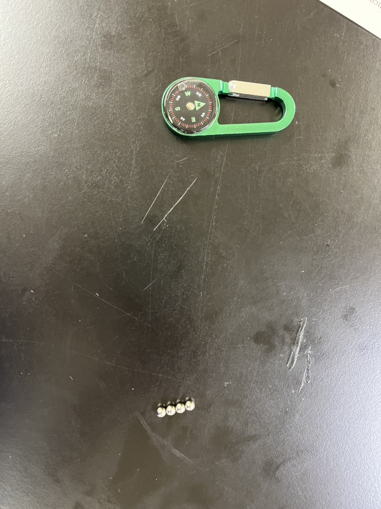
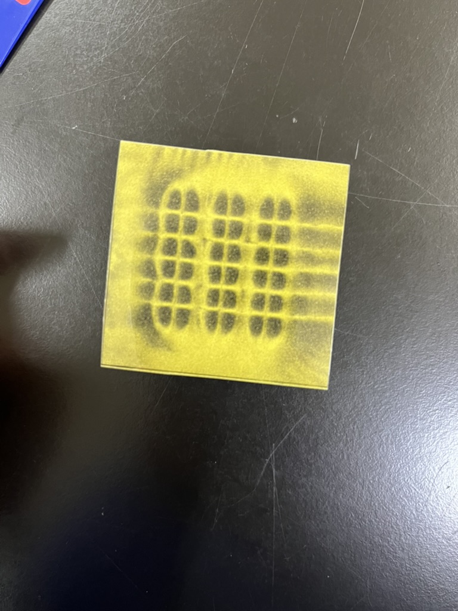

# Technical Report: 3D magnet puzzle

## 4I09 InoueKoshi
## 2025/5/26 , 6/2

## History
The history of magnets is a story of human curiosity and technological innovation, from ancient discoveries to modern science.

### 1. Ancient Times: Encounter with Natural Magnets

The history of magnets begins with the discovery of the naturally occurring magnet "lodestone," a form of magnetite.

* **Discoveries in Greece and China**: Around 600 BC, a legend from the Magnesia region of ancient Greece tells of the discovery of a strange stone that attracted iron. It is said to have started when a shepherd boy named Magnes found that the iron nails in his shoes and the iron tip of his staff were pulled towards this stone, which is believed to be the origin of the word "magnet."
* **Applications in China**: Around the same period, magnets were also known in China. Writings from the 4th century BC describe magnet-like divination tools. By the 11th century, the "south-pointing fish," which utilized the directional properties of magnets, was created, becoming the prototype for the world's first compass.

### 2. Middle Ages to the Age of Discovery: The Invention of the Compass and its Contribution to Navigation

The compass, invented in China, was transmitted to Europe via the Islamic world around the 12th century.

* **A Revolution in Navigation**: The advent of the compass allowed for navigation regardless of the weather, which had previously relied on the positions of the sun and stars. This enabled long-distance voyages and provided crucial technological support for the Age of Discovery, which began in the 15th century.
* **Early Research**: In the 13th century, the French scholar Petrus Peregrinus conducted experiments with a spherical magnet and an iron needle, discovering that magnets have two distinct "poles."

### 3. 17th to 19th Centuries: The Dawn of Magnetism as a Science

Research on magnets progressed significantly with the development of modern science.

* **William Gilbert**: In 1600, the English physician William Gilbert systematically compiled the results of his many experiments in his book "De Magnete" (On the Magnet). He proposed the concept of "terrestrial magnetism"—that the Earth itself is a giant magnet—and scientifically explained why a compass points north. This transformed magnetism from a mystical phenomenon into a subject of scientific study.
* **The Link Between Electricity and Magnetism**: In 1820, the Danish physicist Hans Christian Ørsted accidentally discovered that a compass needle deflected when placed near a wire carrying an electric current, revealing that electricity and magnetism were related.
* **The Invention of the Electromagnet**: Building on this discovery, in 1825, the English inventor William Sturgeon created the "electromagnet" by wrapping a wire around an iron core and passing a current through it, creating a powerful magnet.
* **The Completion of Electromagnetism**: Subsequently, Michael Faraday discovered the law of electromagnetic induction, and James Clerk Maxwell completed the theory of electromagnetism with Maxwell's equations, providing a unified understanding of electrical and magnetic phenomena.

### 4. 20th Century to Present: The Emergence of Powerful Permanent Magnets and Their Modern Applications

In the 20th century, the development of more powerful and high-performance "permanent magnets" advanced dramatically. Japanese researchers, in particular, made significant contributions in this field.

* **Alnico Magnets (1931)**: Invented by Dr. Tokushichi Mishima of Japan. Composed mainly of iron, aluminum, nickel, and cobalt, they were much stronger than previous magnets.
* **Ferrite Magnets (1930s)**: Also invented in Japan by Dr. Yogoro Kato and Dr. Takeshi Takei. Made from inexpensive iron oxide, they are cost-effective and still widely used in speakers and motors today.
* **The Era of Rare-Earth Magnets**:
    * **Samarium-Cobalt Magnets (1960s)**: A pioneer of rare-earth magnets, they are extremely strong, resistant to rust, and stable against temperature changes.
    * **Neodymium Magnets (1984)**: Invented by Dr. Masato Sagawa of Japan, these are the strongest permanent magnets currently in practical use. Their small size and immense strength make them indispensable for modern technologies, including hard disk drive heads, mobile phone speakers and vibrators, motors for hybrid and electric vehicles, and MRI (Magnetic Resonance Imaging) equipment.

Thus, the history of magnets, which began with the discovery of a mysterious stone in ancient times, is deeply intertwined with the development of human navigation, science, and modern technology. Today, research continues worldwide to develop even higher-performance magnetic materials and new technologies that utilize magnetism.

## Properties of magnets

Magnets have several fundamental properties that are crucial for many modern technologies. Here are the main properties, explained in relation to your photos.

### 1. Property of Attraction
This is the most well-known property of a magnet: its ability to attract specific metals like iron, nickel, and cobalt (known as ferromagnetic materials). The **small spherical magnets** in your photo would easily attract objects like paper clips or iron filings.

### 2. Presence of Poles (N and S)
Every magnet has two poles: a "North pole" (N) and a "South pole" (S). No matter how small you break a magnet, each piece will still have both a North and a South pole. A single pole (called a magnetic monopole) has never been discovered.

### 3. Attraction and Repulsion
Like poles repel each other, while opposite poles attract. This means an N pole will repel another N pole, but it will attract an S pole. If you were to bring the **spherical magnets** in the photo near each other, they would either snap together or strongly push each other away, depending on their orientation.

### 4. Directional Property
This property is perfectly demonstrated by the **compass attached to the green carabiner** in your photo. Because the Earth itself acts as a giant magnet (with a magnetic South pole near the geographic North Pole), a freely moving magnet (like a compass needle) will align itself with Earth's magnetic field. Its N pole will point towards the Earth's geographic North. This would work right now in your current location of Suzuka, Mie.

### 5. Invisible Magnetic Field
A magnet creates an invisible area of influence around it called a "magnetic field." This field is often visualized with "magnetic field lines" that flow from the N pole to the S pole. While the field is invisible, it can be seen using the **yellow card** in your other photo.
* **About the Yellow Card (Magnetic Viewer)**: This card contains tiny magnetic particles suspended in a special liquid. When placed on a magnet, these particles align with the magnetic field lines, revealing the field's pattern.
* **Meaning of the Pattern**: The card in the photo shows a distinct grid-like pattern. This indicates that it is placed on a special "multi-pole" magnet, where N and S poles are arranged in a dense, alternating array. Each small square in the grid represents the field around a single magnetic pole, visualizing how the lines of force interact with the neighboring opposite poles.

These properties are applied in countless devices we use every day, including electric motors, speakers, computer hard drives, and medical MRI machines.
