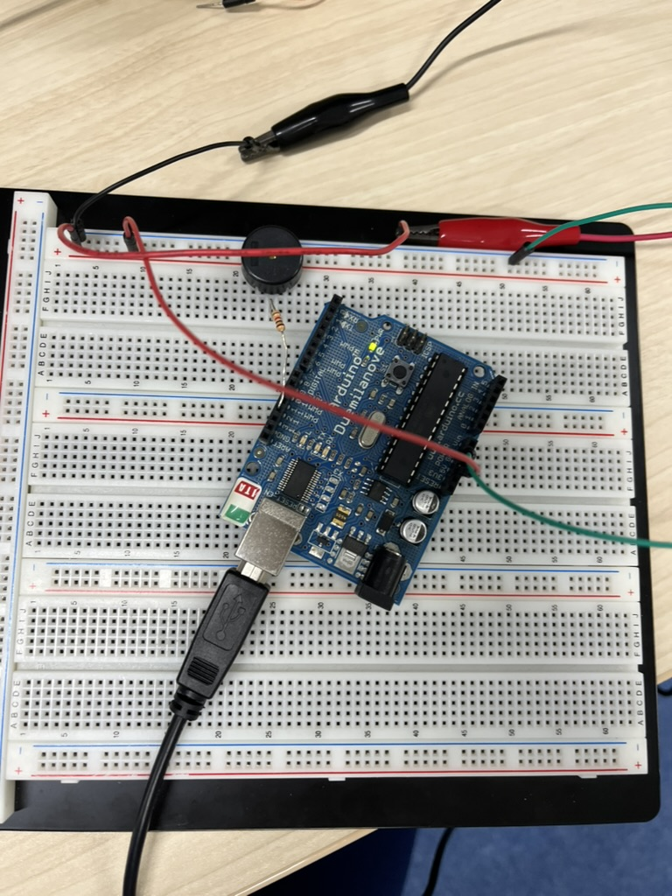
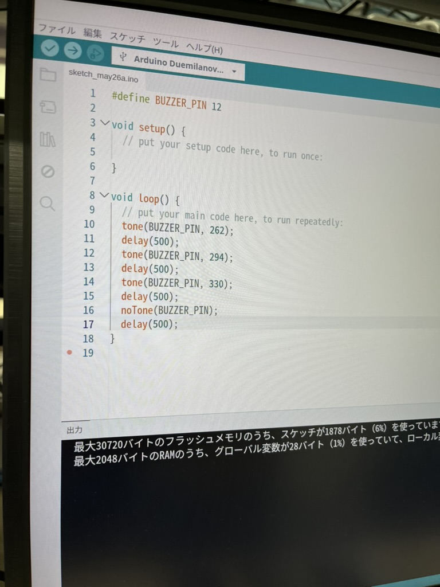
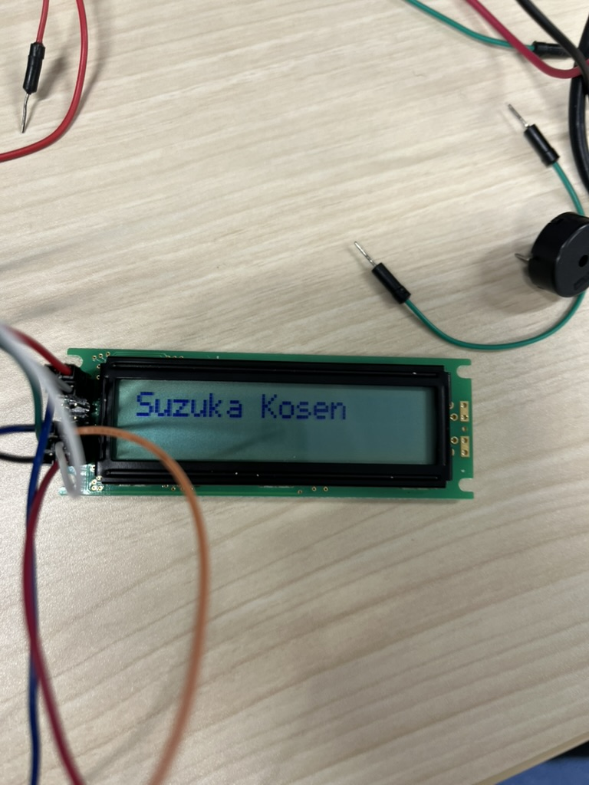
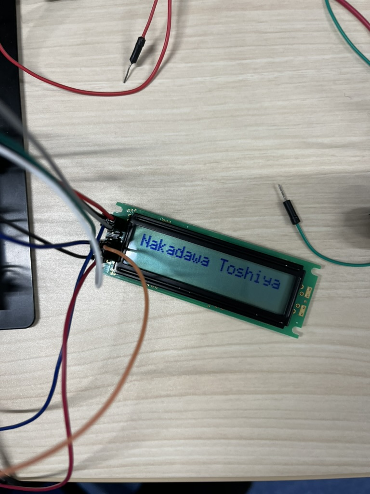
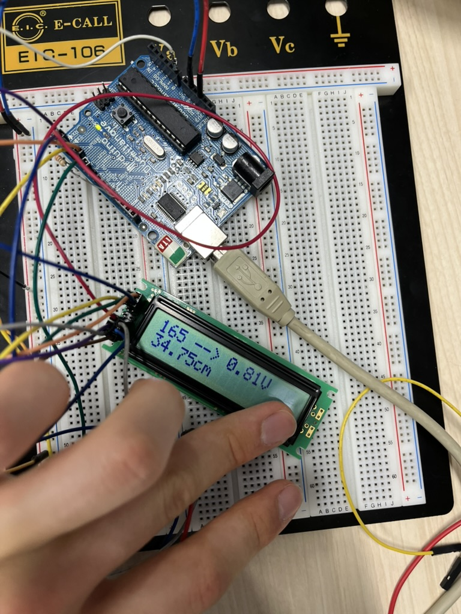

# Technical Report: Microcontroller Electronic Control with Arduino

## 4I09 InoueKoshi
## 2025/5/26 , 6/2

## 1. Introduction

[cite_start]We are surrounded by a multitude of electronic devices that have become indispensable to our daily lives. [cite_start]A fundamental understanding of their operation is therefore crucial. [cite_start]The core principle of these devices is electronic control, a process where input data is received, processed, and used to generate a corresponding output. [cite_start]For example, an air conditioner uses a temperature sensor (input) to determine how much cool air (output) to release. [cite_start]This processing is managed by hardware components called microcontrollers, which execute a set of instructions known as a program (software).

[cite_start]This report details a series of hands-on exercises designed to provide practical experience with electronic control using the Arduino platform[cite: 4, 9]. The objective was to construct and program several circuits to understand the relationship between hardware and software. [cite_start]The experiments included controlling a simple output device (a buzzer) [cite: 93][cite_start], displaying information on a Liquid Crystal Display (LCD) [cite: 382][cite_start], reading data from an analog input device (a distance sensor) [cite: 536][cite_start], and integrating these elements to create a functional rangefinder with an audible alarm.

## 2. Method and Experiment

### 2.1 Materials
The following electronic components were used for the exercises:
* [cite_start]**PC:** Used to write, compile, and transfer programs to the Arduino microcontroller.
* [cite_start]**Arduino UNO:** A microcontroller board that serves as the "brain" of the circuits, executing programs to control other electronic parts.
* [cite_start]**Breadboard:** A board that allows for the temporary prototyping of electronic circuits without requiring soldering.
* [cite_start]**Distance Sensor:** An input device that measures distances from approximately 10 to 80 cm using an infrared LED.
* [cite_start]**Liquid Crystal Display (LCD):** An output device capable of displaying 16 characters on two separate lines.
* [cite_start]**Buzzer:** An output device that produces sound via a piezoelectric element when it receives an electrical signal.
* [cite_start]**Jumper Wires and Alligator Clips:** Used to establish electrical connections between the Arduino and various components on the breadboard.
* [cite_start]**Resistors:** Components that limit the flow of electrical current. [cite_start]Both fixed and variable resistors were used.

### 2.2 Experimental Procedure

**2.2.1 Experiment 1: Basic Output with a Buzzer**
[cite_start]First, a simple circuit was assembled to produce sound. [cite_start]A buzzer and a 1 kΩ resistor were connected to the Arduino's digital pin D12 and Ground (GND) pin. [cite_start]Using the Arduino IDE software, the board was configured as "Arduino Duemilanove or Diecimila"  [cite_start]and connected to the appropriate PC communication port. [cite_start]A program was written and uploaded to the Arduino that instructed it to repeatedly turn the buzzer on at a frequency of 440 Hz for one second, and then turn it off for one second.

**2.2.2 Experiment 2: Character Display with an LCD**
[cite_start]The previous circuit was expanded by adding a 16x2 LCD screen and a variable resistor for contrast adjustment. [cite_start]The LCD was connected to the Arduino's digital pins 2 through 7. [cite_start]A new program was uploaded that first displayed a static message ("Suzuka Kosen") upon startup. [cite_start]The program then listened for data sent from the PC via the "Serial Monitor" tool and displayed any received text on the LCD.

**2.2.3 Experiment 3: Distance Measurement and Alarm**
[cite_start]This experiment was conducted in four stages to build a complete rangefinder.
1.  [cite_start]**Sensor Characterization:** The relationship between distance and the sensor's voltage output was determined. [cite_start]A digital multimeter was connected to the sensor's voltage output pin (Vo). [cite_start]An object was placed at 10 cm increments, from 10 cm to 70 cm, and the corresponding voltage was recorded at each step.
2.  [cite_start]**Reading Voltage with Arduino:** The digital multimeter was replaced by the Arduino. [cite_start]The sensor's Vo pin was connected to the Arduino's analog input pin A0. [cite_start]A program was uploaded to read this analog value, convert it into a voltage reading, and display the voltage on the LCD. [cite_start]The `analogRead()` function converts the 0-5V input into a numerical value between 0 and 1023.
3.  [cite_start]**Creating a Rangefinder:** The program was modified to convert the measured voltage into a distance. [cite_start]This was achieved by applying an inverse equation ($l = d/v$) derived from the sensor characterization data. [cite_start]The final calculated distance in centimeters was displayed on the LCD.
4.  [cite_start]**Adding an Alarm:** A final software modification was made to add an alarm. [cite_start]An `if` statement was added to the code to activate the buzzer whenever the measured distance was 30 cm or less.

## 3. Results and Discussion

### 3.1 Buzzer and Musical Tones
[cite_start]The initial experiment was successful, with the buzzer producing an audible 440 Hz tone intermittently as programmed[cite: 294]. This exercise demonstrated basic digital output control. [cite_start]The manual further explained that the frequency of the electrical signal determines the musical pitch of the sound[cite: 356]. [cite_start]By referencing a provided table of frequencies for different musical notes [cite: 360, 364][cite_start], it was possible to write a program that played a simple "Do-Re-Mi" scale, showcasing the versatility of software in controlling hardware output.

### 3.2 LCD Character Display
The second experiment successfully demonstrated communication between the PC, the Arduino, and the LCD. [cite_start]The LCD correctly showed the initial pre-programmed message upon startup. [cite_start]Subsequently, it accurately displayed alphanumeric characters that were typed into the serial monitor on the PC, confirming that the Arduino could receive and process serial data in real-time.

### 3.3 Distance Sensor and Rangefinder Performance
[cite_start]The characterization of the distance sensor revealed an inverse relationship between the distance to an object and the sensor's output voltage. As the distance increased, the voltage decreased. [cite_start]Plotting these values on a graph produced a characteristic curve for the sensor. [cite_start]From this data, an approximate conversion formula ($v = d/l$) was derived to model the sensor's behavior. [cite_start]For example, the point (20 cm, 1.38V) resulted in the equation $v = 27.6 / l$. [cite_start]The document acknowledged that this simple inverse equation is an approximation and contains "error" when compared to the sensor's true characteristics.

[cite_start]The Arduino, when programmed correctly, was able to replace the digital multimeter and provide nearly identical voltage readings, demonstrating its capability as a measurement tool. [cite_start]By implementing the inverse of the characteristic formula ($l = d/v$), a functional rangefinder was created that displayed the measured distance on the LCD.

### 3.4 Alarm Functionality and Applications
[cite_start]The rangefinder was successfully upgraded with an alarm that triggered the buzzer at a predefined distance [cite: 848][cite_start], demonstrating conditional logic in programming. The manual proposed several modifications to this function, highlighting the power of software. [cite_start]These included changing the alarm's pitch at different proximity levels  [cite_start]or playing a melody and displaying a "caution!" message. [cite_start]Further suggested applications involved using linear or inverse equations to make the alarm's pitch a continuous function of distance, creating a more intuitive user feedback system.

## 4. Conclusion

This series of hands-on exercises successfully demonstrated the fundamental principles of microcontroller-based electronic control. Through the assembly and programming of an Arduino, it was possible to control various output devices (buzzer, LCD), process input from an analog sensor, and integrate these parts into a cohesive, functional system—a rangefinder with a programmable alarm.

[cite_start]The experiments provided an enjoyable and practical introduction to the "fun" of building devices. [cite_start]This experience fosters an "engineer-like" perspective on the inner workings of the electronic products that are ubiquitous in modern life. [cite_start]By successfully bridging the gap between a written program and a physical circuit's behavior, this work serves as a valuable entry point into the "world of assembly".